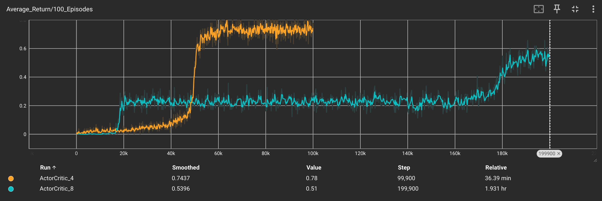

# 🧊 FrozenLake Mastery: Actor-Critic on Slippery Ice

This project implements the **Actor-Critic** algorithm for solving OpenAI Gymnasium's FrozenLake environment with slippery tiles enabled (`is_slippery=True`). We compare learning performance on both the standard 4×4 map and the more challenging 8×8 grid.


FrozenLake is a classic reinforcement learning challenge:
- Grid world with safe tiles, holes, and a goal
- When `is_slippery=True`, the agent has only a 33% chance of moving in the intended direction
- The stochastic nature makes this much harder than the deterministic version

## 🧠 Actor-Critic Implementation

```
State → One-Hot Encoding → FC Layer (128) → [Actor Head, Critic Head]
```

- **Actor (Policy)**: Learns which action to take
- **Critic (Value)**: Evaluates how good states are
- **Combined Learning**: Uses TD errors to update both networks

## 📊 Training Results

| Environment | Episodes | Training Time | Success Rate |
|-------------|----------|---------------|--------------|
| 4×4 Slippery| 100K     | 36.39 min     | ~74%         |
| 8×8 Slippery| 200K     | 1.931 hr      | ~54%         |




### Key Observations:

1. **Learning Curve Differences**:
   - **4×4 Map (Orange)**: Shows faster convergence, reaching stable performance around 50K episodes
   - **8×8 Map (Cyan)**: Demonstrates a long plateau (~160K episodes) before dramatic improvement

2. **The Slippery Challenge**:
   - Even after extensive training, success rates remain below 100% due to environmental randomness
   - The 8×8 map is significantly more challenging, requiring twice as many episodes

## ⚙️ Technical Details

- **Hyperparameters**:
  - Learning rate: 0.0002
  - Discount factor (γ): 0.98
  - n_rollout: 20
  
- **Network Architecture**:
  - Shared feature extraction (128 neurons)
  - Policy head (Actor): Outputs action probabilities
  - Value head (Critic): Outputs state value estimates

- **Training Process**:
  - TD learning with advantage
  - Batched updates after n_rollout steps
  - TensorBoard logging for performance tracking


## 🔍 Insights & Future Work

- **Stochasticity Impact**: Slippery tiles significantly increase learning difficulty compared to deterministic environments
- **Scaling Challenges**: The jump from 4×4 to 8×8 dramatically increases training time and reduces success rates
- **Potential Improvements**: Implementing PPO, A2C or DQN might improve learning efficiency and final performance

---
