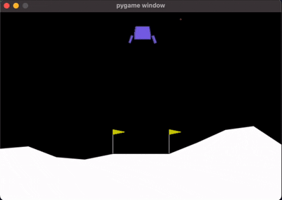
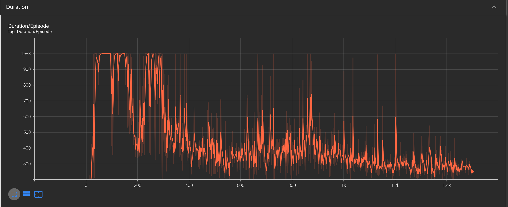

# DQN on LunarLander-v3: Experiment Log

This project explores Deep Q-Networks (DQN) on the [LunarLander-v3](https://gymnasium.farama.org/environments/box2d/lunar_lander/) environment using PyTorch and TensorBoardX for tracking progress. The experiment is inspired by the classic DQN tutorial, but with a larger network and more episodes to tackle the harder LunarLander task.

---

## 🚀 Experiment Setup

- **Environment:** LunarLander-v3 (Gymnasium)
- **Network:** 2 hidden layers, 256 units each (bigger than CartPole)
- **Replay Buffer:** 100,000 transitions
- **Batch Size:** 256
- **Discount Factor (γ):** 0.99
- **Epsilon-Greedy:** Decays from 0.9 to 0.01 (slower decay)
- **Target Network Update:** Soft update with τ=0.01
- **Optimizer:** AdamW, learning rate 1e-4
- **Episodes:** 1500 (on GPU/Apple Silicon)

---

## 📊 Tracking Progress

We used **TensorBoardX** to log and visualize:

- **Return vs Episode:** How much reward the agent gets each episode.
- **Duration vs Episode:** How long (in steps) the agent survives each episode.

---

### Agent in Action

*The agent learns to land safely between the flags!*

---

### Return vs Episode

- Early episodes: Returns are low and noisy as the agent explores.
- After ~200 episodes: Returns rise and stabilize, showing the agent is learning to land safely.
- Occasional dips: The agent sometimes "forgets" or explores, but overall performance improves.

---

### Duration vs Episode

- At first, durations are short (crashes!).
- As training progresses, the agent survives longer, with more consistent episode lengths.
- Spikes and drops reflect exploration and the stochastic nature of the environment.

---

## 💡 What Did We Learn?

- **Reward and duration both matter:** Tracking both gives a fuller picture of learning.
- **DQN works for LunarLander:** With enough training and a big enough network, the agent learns a robust landing policy.
- **TensorBoardX is awesome:** Live graphs make it easy to spot learning progress and issues.

---