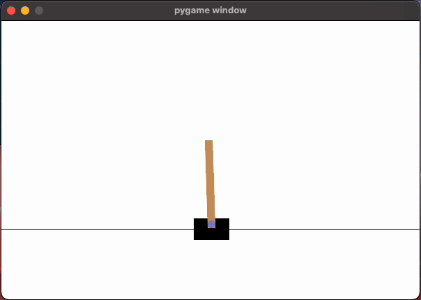

# DQN Experiments: LunarLander & CartPole

This project explores Deep Q-Networks (DQN) on two classic reinforcement learning environments: **LunarLander-v3** and **CartPole-v1**. We tracked learning progress with TensorBoardX and visualized both the agent’s return and performance in action.

---

## 🚀 LunarLander-v3

- **Environment:** LunarLander-v3 (continuous 2D lander)
- **Network:** 2 hidden layers, 256 units each
- **Replay Buffer:** 100,000 transitions
- **Batch Size:** 256
- **Episodes:** 1500

### Findings

- **Return vs Episode:** The agent learns to land safely after a few hundred episodes, with returns rising and stabilizing over time.

- **Duration vs Episode:** The agent survives longer as training progresses, indicating better control and landing skills.

---

## 🎯 CartPole-v1

- **Environment:** CartPole-v1 (classic control, balance the pole)
- **Network:** 2 hidden layers, 128 units each
- **Replay Buffer:** 10,000 transitions
- **Batch Size:** 128
- **Episodes:** 600 (on GPU/Apple Silicon)

### Results

#### Return vs Episode

- The agent starts with low returns, but after ~100 episodes, performance improves rapidly.
- By episode 400, the agent consistently achieves the maximum possible return, showing it has mastered balancing the pole.
- Occasional drops reflect ongoing exploration or environment stochasticity.

#### Agent Demo

- The trained agent keeps the pole balanced for the full duration.

---

## 📊 Tracking Progress with TensorBoardX

We logged:
- **Return/Episode:** Total reward per episode (how well the agent performed)
- **Duration/Episode:** Number of steps survived per episode (especially meaningful for CartPole)

To view the learning curves:

`tensorboard --logdir runs`

Open [http://localhost:6006](http://localhost:6006) in your browser.

---

## 💡 What We Learned

- **DQN is effective:** With a good network and enough training, DQN can solve both LunarLander and CartPole.
- **Visualization is key:** TensorBoardX graphs make it easy to spot when the agent is learning or stuck.
- **Saving models:** We saved and loaded both `policy_net` and `target_net` for reproducibility and further testing.

---

## 🛠️ How to Run

1. Install requirements:  
   `pip install gymnasium[box2d] torch tensorboardX matplotlib`
2. Run the training script for either environment.
3. Launch TensorBoard to monitor learning.

---