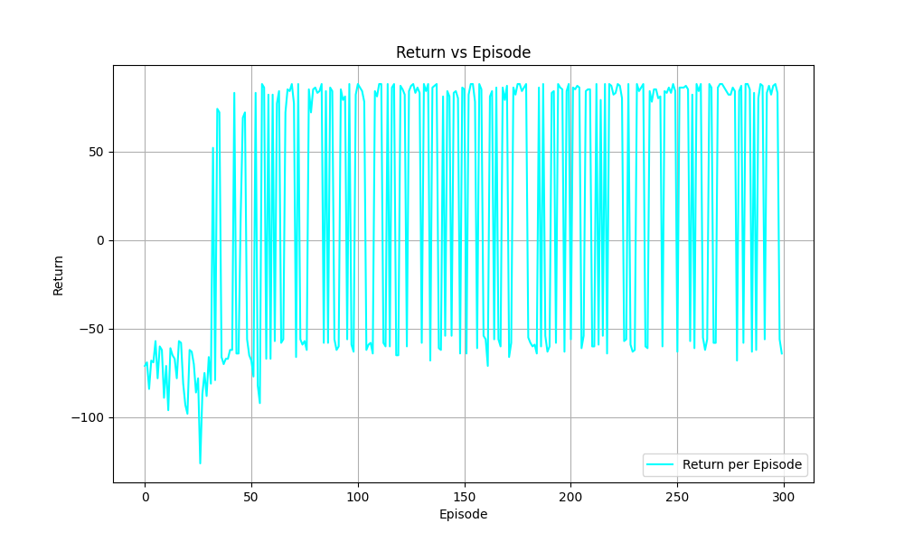
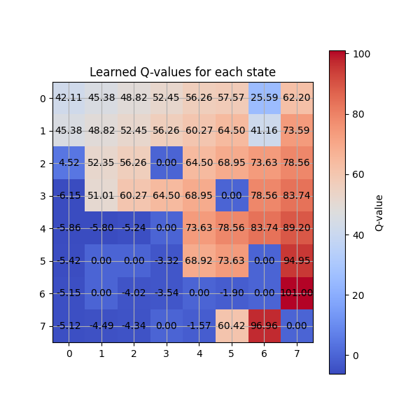
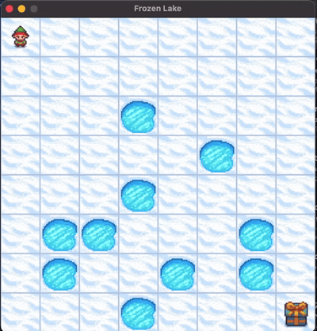

# Q-Learning on Frozen Lake

- **Environment:** 8x8 Frozen Lake, deterministic (no slipping!)
- **Agent:** Q-learning, exploring and learning from scratch
- **Rewards:**  
  - +100 for reaching the goal  
  - -50 for falling in a hole  
  - -1 for every step (to keep the agent moving)
- **Episodes:** 300 (enough to see some learning, but not too long to get bored)

---

## What Did the Agent Learn?

### 📈 Return vs Episode

I tracked the *total return* (sum of rewards) for each episode. Here’s the graph:

- **Big spikes up:** Agent reached the goal!
- **Big dips down:** Agent fell into a hole. Ouch.
- **Flat-ish:** Agent is still figuring things out.

---

### 🗺️ Q-Value Heatmap

After training, I checked out the *Q-values* for each state. The brighter the color, the more promising that state is for the agent.

- **Hot spots:** The agent figured out which states are close to the goal (bottom right).
- **Cold zones:** Holes and dead ends-places to avoid!

---

### 🎬 Watch the Agent Go!

Want to see the agent in action? Here’s a GIF of a test run after training:

---

## What I Found Interesting

- **Reward shaping matters:** The big bonus/penalty made the agent *really* care about the goal and holes.
- **Exploration is key:** With a bit of randomness, the agent found new paths and didn’t get stuck.
- **Visualization helps:** The heatmap and return graph made it easy to see learning progress (and mistakes).

---

## Try It Yourself!

Clone this repo, run the code, and see what your agent learns!  

> python main.py 
