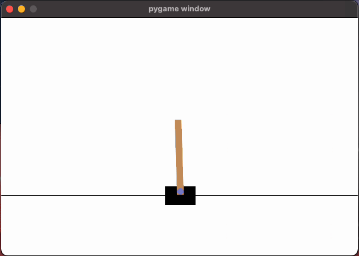
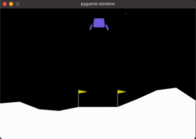

# Reinforcement Learning Journey 🚀

Welcome to the **Reinforcement Learning Journey**!  
This repository is a personal and practical exploration of classic and modern reinforcement learning (RL) algorithms, with hands-on code and experiments.

--- 

## 📚 What You'll Find

- **Q-Learning**:  
  Classic tabular Q-learning for discrete environments (e.g., FrozenLake).  
  Simple, interpretable, and a great RL starting point!

- **Deep Q-Network (DQN)**:  
  Neural network-based Q-learning for environments with larger or continuous state spaces.  
  Includes experience replay, target networks, and more.

- **REINFORCE**:  
  The foundational policy gradient algorithm.  
  Learn how to directly optimize policies using episode returns.

---

## 🤖 Agents on the go

Implementing RL Algorithms on multiple games.





---

## 🛠️ Getting Started

1. **Clone the repository**
   ```
   git clone https://github.com/cannibalcheeseburger/reinforcement-learning.git
   cd reinforcement-learning
   ```

2. **Set up the environment**
   ```
   conda env create -f environment.yml
   conda activate rl
   ```

3. **Run the Notebooks**
   - Open JupyterLab or Jupyter Notebook and explore the projects in each subfolder.

---

## 💡 Highlights

- **Modular code**: Each algorithm in its own folder for clarity.
- **Reproducible experiments**: Environment files and scripts included.
- **HPC-ready**: Scripts for running jobs on high-performance clusters.
- **Learning by doing**: Code is commented and designed for experimentation.

---

## 👾 Algorithms Covered

- Q-Learning (Tabular)
- Deep Q-Network (DQN)
- REINFORCE (Policy Gradient)
- More coming soon!

---

## 📈 Example Results

- **Q-Learning**: Solves FrozenLake-v1 (4x4 and 8x8) with tabular methods.
- **DQN**: Learns to balance CartPole and tackle more complex environments.
- **REINFORCE**: Demonstrates policy gradient learning on discrete tasks.

