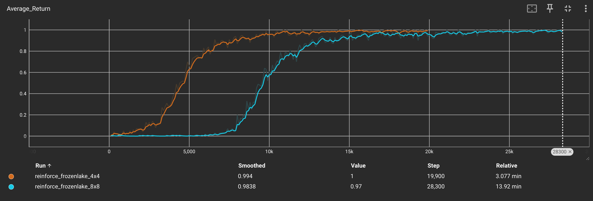

# ❄️ REINFORCE on FrozenLake: A Curious RL Experiment

Welcome! This repo is a hands-on adventure in reinforcement learning, where we teach an agent to cross a frozen lake using the REINFORCE policy gradient algorithm. We tried both the classic **4x4** and the much trickier **8x8** FrozenLake maps-without any slippery ice!

---

## 🤖 How Does the Agent Learn?

- **Algorithm:** REINFORCE (Monte Carlo Policy Gradient)
- **State Representation:** One-hot encoding (each tile is a unique input)
- **Network:** Simple neural net with 128 hidden units
- **Optimizer:** Adam, learning rate 0.0001
- **Discount factor:** γ = 0.99
- **No slip:** The agent moves exactly where it wants (no random sliding!)

---

## 📈 What Did We Observe?

- **4x4 Map:**  
  The agent learns quickly-within a few thousand episodes, it finds the goal almost every time!
- **8x8 Map:**  
  Much harder! The agent needs way more episodes (and patience) but eventually gets the hang of it.

| Map Size | Episodes to Succeed | Training Time | Final Success Rate |
|----------|--------------------|---------------|--------------------|
| 4x4      | ~5,000             | ~3 min        | 100%               |
| 8x8      | ~15,000+           | ~14 min       | 97%                |

You can see the learning curve in TensorBoard (just run `tensorboard --logdir runs`).

---

## 🧪 What’s Next?

- Try with the slippery version (`is_slippery=True`) for extra challenge!
- Compare with Q-learning or Actor-Critic.
- Add entropy regularization or advantage baselines.
- Can you make it work even faster?

---

